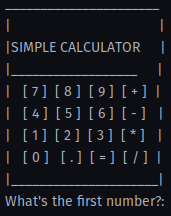

# Simple Python Calculator

This project provides a basic command-line calculator implemented in Python.



## Features:
- Basic mathematical operations: addition, subtraction, multiplication, and division.
- Continuous calculations: After performing an operation, you can continue with the result for further calculations.
- User-friendly: Prompts guide the user through the entire process.
- Neat ASCII art logo for visual appeal.

## Installation:
1. Clone the repository:
   ```
   git clone https://github.com/j-breedlove/simple_calculator_cli.git
   ```
2. Navigate to the project directory:
   ```
   cd simple_calculator_cli
   ```
3. Create environment and Install required packages:
   ```
   pip install pipenv
   pipenv install
   pipenv shell
   pipenv install <package_name>
   ```
4. Run the application:
   ```
   python main.py
   ```

## Usage:
1. Run `main.py` to start the program.
2. Follow the on-screen prompts.

## Requirements:
- Python 3.x

## Contributing:
Pull requests are welcome. For major changes, please open an issue first to discuss what you would like to change.

## License:
MIT
